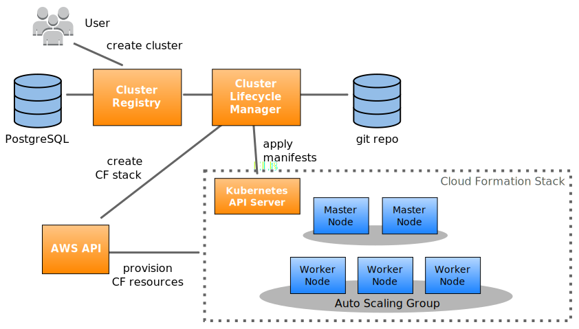
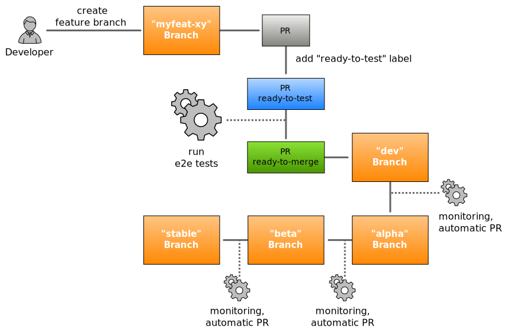
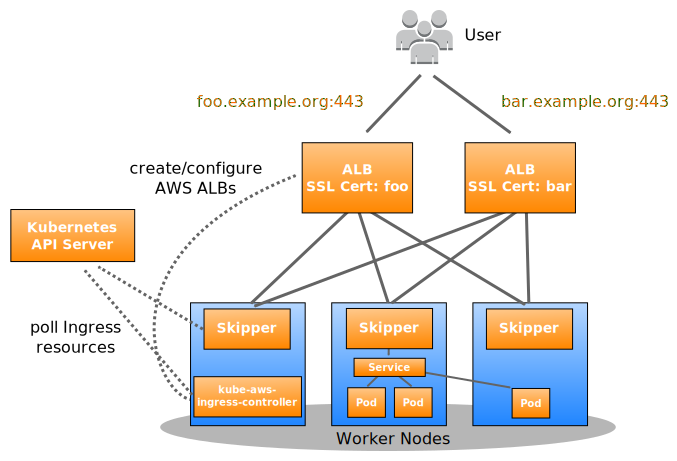
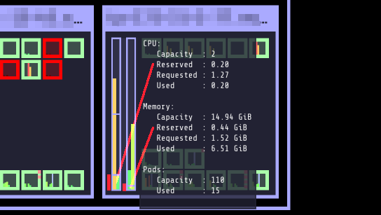

================================
Running Kubernetes in Production
================================

This document should briefly describe our learnings in Zalando Tech while running Kubernetes on AWS in production. As we just recently started to migrate to Kubernetes, we consider ourselves far from being experts in the field. This document is shared in the hope that others in the community can benefit from our learnings.

Context
=======

We are a team of infrastructure engineers provisioning Kubernetes clusters for our Zalando Tech delivery teams. We plan to have more than 30 production Kubernetes clusters. The following goals might help to understand the remainder of the document, our Kubernetes setup and our specific challenges:

* No manual operations: all cluster updates and operations need to be fully automated.
* No pet clusters: clusters should all look the same and not require any specific configurations/tweaking
* Reliability: the infrastructure should be rock-solid for our delivery teams to entrust our clusters with their most critical applications
* Autoscaling: clusters should automatically adapt to deployed workloads and hourly scaling events are expected
* Seamless migration: Dockerized `twelve-factor apps`_ currently deployed on `AWS/STUPS`_ should work without modifications on Kubernetes

.. _twelve-factor apps: https://12factor.net/
.. _AWS/STUPS: https://stups.io/

Cluster Provisioning
====================

There are many tools out there to provision Kubernetes clusters. We chose to adapt `kube-aws`_ as it matches our current way of working on AWS: immutable nodes configured via cloud-init and Cloud Formation for declarative infrastructure. CoreOS’ Container Linux perfectly matches our understanding of the node OS: only provide what is needed to run containers, not more.

Only one Kubernetes cluster is created per AWS account. We create separated AWS accounts/clusters for production and test environments.

We always create two AWS Auto Scaling Groups (ASGs, “node pools”) right now:

* One master ASG with always two nodes which run the API server and controller-manager
* One worker ASG with 2 to N nodes to run application pods

Both ASGs span multiple Availability Zones (AZ). The API server is exposed with TLS via a “classic” TCP/SSL Elastic Load Balancer (ELB).

We use a custom built Cluster Registry REST service to manage our Kubernetes clusters. Another component (Cluster Lifecycle Manager, CLM) is regularly polling the Cluster Registry and updating clusters to the desired state.
The desired state is expressed with Cloud Formation and Kubernetes manifests `stored in git`_.

Different clusters can use different channel configurations, i.e. some non-critical clusters might use the “alpha” channel with latest features while others rely on the “stable” channel.
The channel concept is similar to how CoreOS manages releases of Container Linux.

Clusters are automatically updated as soon as changes are merged into the respective branch.
Configuration changes are first tested in a separate feature branch, afterwards the pull request to the "dev" branch (channel) is automatically tested end-to-end (this includes the official Kubernetes conformance tests).

.. _kube-aws: https://github.com/coreos/kube-aws
.. _stored in git: https://github.com/zalando-incubator/kubernetes-on-aws

AWS Integration
===============

We provision clusters on AWS and therefore want to integrate with AWS services where possible. The kube2iam_ daemon conveniently allows to assign an AWS IAM role to a pod by adding an annotation. Our infrastructure components such as the autoscaler use the same mechanism to access the AWS API with special (restricted) IAM roles.

.. _kube2iam: https://github.com/jtblin/kube2iam

Ingress
=======

There is no official way of implementing Ingress on AWS. We decided to create a new component `Kube AWS Ingress Controller`_ to achieve our goals:

* SSL termination by ALB: convenient usage of ACM (free Amazon CA) and certificates upload to AWS IAM
* Using the “new” ELBv2 Application Load Balancer

We use Skipper_ as our HTTP proxy to route based on Host header and path. Skipper is running as a ``DaemonSet`` on all worker nodes for convenient AWS ASG integration (new nodes are automatically registered in the ALB's Target Group).
Skipper directly comes with a Kubernetes data client to automatically update its routes periodically.

Mate_ is automatically configuring the Ingress hosts as DNS records in Route53 for us.

.. _Kube AWS Ingress Controller: https://github.com/zalando-incubator/kube-ingress-aws-controller
.. _Skipper: https://github.com/zalando/skipper
.. _Mate: https://github.com/zalando-incubator/mate

Resources
=========

Understanding the Kubernetes resource requests and limits is crucial.

Default resource requests and limits can be configured via the LimitRange_ resource. This can prevent “stupid” incidents like JVM deployments without any settings (no memory limit and no JVM heap set) eating all the node’s memory.

We provide a `tiny script`_ and use the Downwards API to conveniently run JVM applications on Kubernetes without the need to manually set the maximum heap size. The container spec of a ``Deployment`` for some JVM app would look like this:

.. code-block:: yaml

        # ...
        env:
          # set the maximum available memory as JVM would assume host/node capacity otherwise
          # this is evaluated by java-dynamic-memory-opts in the Zalando OpenJDK base image
          # see https://github.com/zalando/docker-openjdk
          - name: MEM_TOTAL_KB
            valueFrom:
              resourceFieldRef:
                resource: limits.memory
                divisor: 1Ki
        resources:
          limits:
            memory: 1Gi

`Kubelet can be instructed to reserve a certain amount of resources`_ for the system and for Kubernetes components (kubelet itself and Docker etc). Reserved resources are subtracted from the `node’s allocatable resources`_. This improves scheduling and makes resource allocation/usage more transparent. Node allocatable resources or rather reserved resources are also visible in `Kubernetes Operational View`_:

.. _LimitRange: https://github.com/kubernetes/community/blob/master/contributors/design-proposals/admission_control_limit_range.md
.. _tiny script: https://github.com/zalando/docker-openjdk/blob/master/utils/java-dynamic-memory-opts
.. _Kubelet can be instructed to reserve a certain amount of resources: https://github.com/kubernetes/kubernetes/blob/1fc1e5efb5e5e1f821bfff8e2ef2dc308bfade8a/cmd/kubelet/app/options/options.go#L227
.. _node’s allocatable resources: https://github.com/kubernetes/community/blob/master/contributors/design-proposals/node-allocatable.md

Graceful Pod Termination
========================

Kubernetes will cause service disruptions on pod terminations by default as applications and configuration need to be prepared for graceful shutdown.
By default, pods receive the TERM signal and ``kube-proxy`` reconfigures the ``iptables`` rules to stop traffic to the pod.
The pod will be killed 30s later by a KILL signal if it did not terminate by itself before.

Kubernetes expects the container to handle the TERM signal and at least wait some seconds for ``kube-proxy`` to change the ``iptables`` rules.
Note that the readinessProbe_ behavior does not matter after having received the TERM signal.

There are two cases leading to failing requests:

* The pod's container terminates immediately when receiving the TERM signal --- thus not giving ``kube-proxy`` enough time to remove the forwarding rule
* Keep-alive connections are not handed over by Kubernetes, i.e. requests from clients with keep-alive connection will still be routed to the pod

Keep-alive connections are the default when using connection pools. This means that nearly all client connections between microservices are affected by pod terminations.

Kubernetes’ default behavior is a blocker for seamless migration from our AWS/STUPS infrastructure to Kubernetes. In STUPS, single Docker containers run directly on EC2 instances. Graceful container termination is not needed as AWS automatically deregisters EC2 instances and drains connections from the ELB on instance termination. We therefore consider solving the graceful pod termination issue in Kubernetes on the infrastructure level. This would not require any application code changes by our users (application developers).

For further reading on the topic, you can find a `blog post about graceful shutdown of node.js on Kubernetes`_ and a `small test app to see the pod termination behavior`_.

.. _readinessProbe: https://kubernetes.io/docs/tasks/configure-pod-container/configure-liveness-readiness-probes/
.. _blog post about graceful shutdown of node.js on Kubernetes: https://blog.risingstack.com/graceful-shutdown-node-js-kubernetes/
.. _small test app to see the pod termination behavior: https://github.com/mikkeloscar/kube-sigterm-test

Autoscaling
===========

Pod Autoscaling
---------------

We are using the HorizontalPodAutoscaler_ resource to scale the number of deployment replicas. Pod autoscaling requires implementing graceful pod termination (see above) to downscale safely in all circumstances. We only used the CPU-based pod autoscaling until now.

.. _HorizontalPodAutoscaler: https://kubernetes.io/docs/user-guide/horizontal-pod-autoscaling/

Node Autoscaling
----------------

Our `experimental AWS Autoscaler`_ is an attempt to implement a simple and elastic autoscaling with AWS Auto Scaling Groups.

Graceful node shutdown is required to allow safe downscaling at any time. We simply added a small `systemd unit to run kubectl drain on shutdown`_.

Upscaling or node replacement poses the risk of race conditions between application pods and required system pods (DaemonSet). We have not yet figured out a good way of postponing application scheduling until the node is fully ready. The kubelet’s Ready condition is not enough as it does not ensure that all system pods such as kube-proxy and kube2iam are running. One idea is using taints during node initialization to prevent application pods to be scheduled until the node is fully ready.

.. _experimental AWS Autoscaler: https://github.com/hjacobs/kube-aws-autoscaler
.. _systemd unit to run kubectl drain on shutdown: https://github.com/zalando-incubator/kubernetes-on-aws/blob/449f8f3bf5c60e0d319be538460ff91266337abc/cluster/userdata-worker.yaml#L92

Monitoring
==========

We use our `Open Source ZMON monitoring platform`_ to monitor all Kubernetes clusters.
ZMON agent and workers are part of every Kubernetes cluster deployment. The agent automatically pushes both AWS and Kubernetes entities to the global ZMON data service.
The `Prometheus Node Exporter`_ is deployed on every Kubernetes node (as a ``DaemonSet``) to expose system metrics such as disk space, memory and CPU to ZMON workers.
Another component `kube-state-metrics`_ is deployed in every cluster to expose cluster-level metrics such as number of waiting pods. ZMON workers also have access to the internal Kubernetes API server endpoint to build more complex checks. AWS resources can be monitored by using ZMON’s CloudWatch wrapper.
We defined global ZMON checks for cluster health, e.g.:

* Number of ready and unschedulable nodes (collected via API server)
* Disk, memory and CPU usage per node (collected via Prometheus Node Exporter and/or CloudWatch)
* Number of endpoints per Kubernetes service (collected via API server)
* API server requests and latency (collected via API server metrics endpoint)

We use `Kubernetes Operational View`_ for ad-hoc insights and troubleshooting.

.. _Open Source ZMON monitoring platform: https://zmon.io/
.. _Prometheus Node Exporter: https://github.com/prometheus/node_exporter
.. _kube-state-metrics: https://github.com/kubernetes/kube-state-metrics

Jobs
====

We use the very convenient Kubernetes CronJob_ resource for various tasks such as updating all our SSH bastion hosts every week.

Kubernetes jobs are not cleaned up by default and completed pods are never deleted. Running jobs frequently (like every few minutes) quickly thrashes the Kubernetes API server with unnecessary pod resources.
We observed a significant slowdown of the API server with increasing number of completed jobs/pods hanging around. To mitigate this, A small kube-job-cleaner_ script `runs as a CronJob every hour`_ and cleans up completed jobs/pods.

.. _runs as a CronJob every hour: https://github.com/zalando-incubator/kubernetes-on-aws/blob/449f8f3bf5c60e0d319be538460ff91266337abc/cluster/manifests/kube-job-cleaner/cronjob.yaml

Security
========

We authorize access to the API server via a `proprietary webhook`_ which verifies the OAuth Bearer access token and looks up user’s roles via another small REST services (backed historically by LDAP).

Access to etcd should be restricted as it holds all of Kubernetes’ cluster data thus allowing tampering when accessed directly.

We use flannel as our overlay network which requires etcd by default to configure its network ranges. There is experimental support for the flannel backend to be switched to the Kubernetes API server. This allows restricting etcd access to the master nodes.

Kubernetes allows to define PodSecurityPolicy_ resources to restrict the use of “privileged” containers and similar features which allow privilege escalation.

Docker
======

Docker is often beautiful and sometimes painful, especially when trying to run containers reliable in production. We encountered various issues with Docker and all of them are not really Kubernetes related, e.g.:

* Docker 1.11 to 1.12.5 included an evil `bug where the Docker daemon becomes unresponsive`_ (``docker ps`` hangs). We hit this problem every week on at least one of our Kubernetes nodes. Our workaround was upgrading to Docker 1.13 RC2 (we now moved back to 1.12.6 as the fix was backported).
* We saw some processes getting stuck in "pipe wait" while writing to STDOUT when using the default Docker ``json`` logger (root cause was not identified yet).
* There seem to be a lot more race conditions in Docker and you can find many "Docker daemon hangs" issues reported, we already expect to hit them once in a while.
* Upgrading Docker clients to `1.13 broke pulls`_ from our `Pier One registry`_ (pulls from gcr.io were broken too). We implemented a quick workaround in Pier One until Docker fixed the issue upstream.
* A `thread on Twitter`_ suggested adding the ``--iptables=false`` flag for Docker 1.13. We spend some time until we found out that this is a bad idea. NAT for the Flannel overlay network breaks when adding ``--iptables=false``.

We learned that Docker can be quite painful to run in production because of the many tiny bugs (race conditions).
You can be sure to hit some of them when running enough nodes 24x7.
Also better not touch your Docker version once you have a running setup.

.. _proprietary webhook: https://github.com/zalando-incubator/kubernetes-on-aws/blob/449f8f3bf5c60e0d319be538460ff91266337abc/cluster/userdata-master.yaml#L319
.. _Kubernetes Operational View: https://github.com/hjacobs/kube-ops-view
.. _PodSecurityPolicy: https://kubernetes.io/docs/user-guide/pod-security-policy/
.. _CronJob: https://kubernetes.io/docs/user-guide/cron-jobs/
.. _kube-job-cleaner: https://github.com/hjacobs/kube-job-cleaner
.. _bug where the Docker daemon becomes unresponsive: https://github.com/docker/docker/issues/28889
.. _1.13 broke pulls: https://github.com/docker/docker/issues/30083
.. _Pier One registry: https://github.com/zalando-stups/pierone
.. _thread on Twitter: https://twitter.com/jbeda/status/826969113801093121
