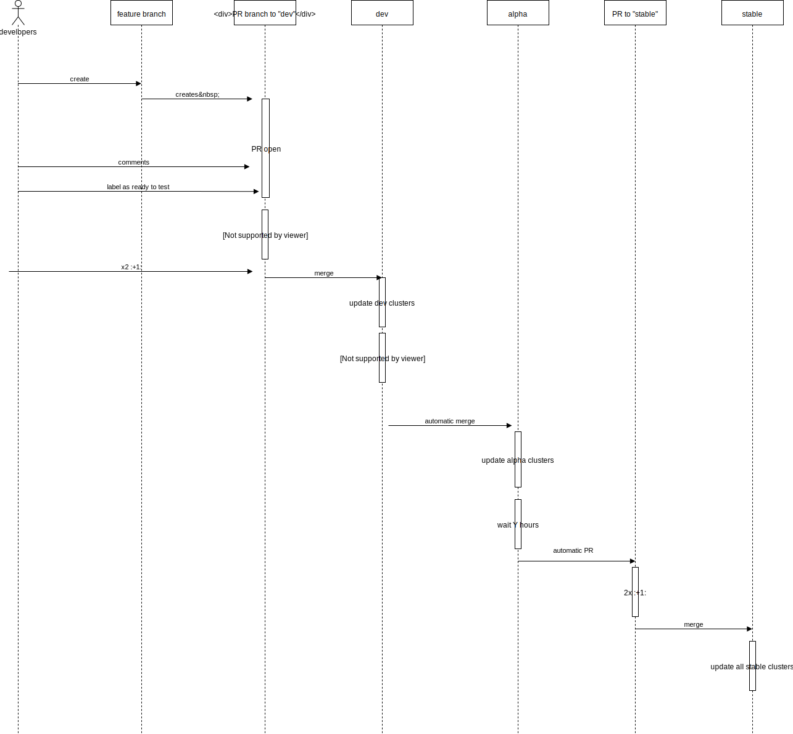

============================
ADR-005: How to use channels
============================

Context
=======

In ADR-004 we defined some initial characteristics of clusters and how they map to git branches and the definition of the ``dev`` branch/channel.
We still needed to define how many branches we use and how to promote from one to the other. In this ADR we answer those remaining questions.

Decision
========

We decided to use the following branches/channels:

``dev``
  this is the default branch for the project. By default all new features and bugfixing that are not to be considered as ``hotfixes`` will be against this channel.
``alpha``
  this is the branch immediately after ``dev``.
``stable``
  this is the most stable branch.

The following diagram shows how the process of working with the channels works:

Every branch with a pull request open will trigger end to end testing as soon as the pull request is labelled as "ready-to-test".
While discussing the end to end (e2e) strategy is out of scope for this ADR, we define here the following requirements:

- The e2e testing infrastructure will create a new cluster
- All the e2e tests will run on the aforementioned cluster
- The e2e tests will report the status to the PR
- The cluster will be deleted as soon as the tests finish

We decide against polluting the cluster registry which means that the testing infrastructure will create the cluster using the Cluster Lifecycle Manager (CLM) functionalities locally and not by creating entries in the cluster registry.

Once the PR is approved and merged into the ``dev`` branch/channel, all the clusters using the channel will be updated. The list includes as a minimum and by design the following clusters:

- Infrastructure cluster to test cluster setup

The cluster above will be tested with smoke tests that could include the end to end tested executed on the branch. Testing on this cluster has the following goals:

- Testing the update on an updated cluster and not on a fresh cluster as this might show some different behavior.
- Testing the impact of the update on already running applications. This requires that the cluster being updated will have running applications covering different Kubernetes features.

Additionally to the tests, ZMON metrics will be monitored closely.
If nothing wrong is seen, after X hours, an *automatic* merge into the ``alpha`` branch will be executed. This will trigger updates to all the cluster running the alpha branch. This include as minimum the following clusters:

- Infrastructure prod cluster
- Infrastructure test cluster
- playground

A transition to ``stable`` channel will be started by an automatic creation of a PR after Y days. Differently from the previous step, this ``PR`` will not be automatically merged, but will require additional human approval.

Hotfixes
--------
Hotfixes can be made via PRs to any of the channels. This allows to increase the speed by which we fix important issues in all the channels. A *hotfix* PR will still need to pass the e2e tests in order to be merged.

Status
======

Accepted.

Consequences
============

The following are important consequences:

- No manual merges to ``alpha`` or ``stable`` channels are possible for changes that are not hotfixes.
- With this ADR we rely heavily on our e2e testing infrastructure to guarantee stability/quality of our PRs.
- Clusters might be assigned to different channels depending of different requirements like SLOs.
