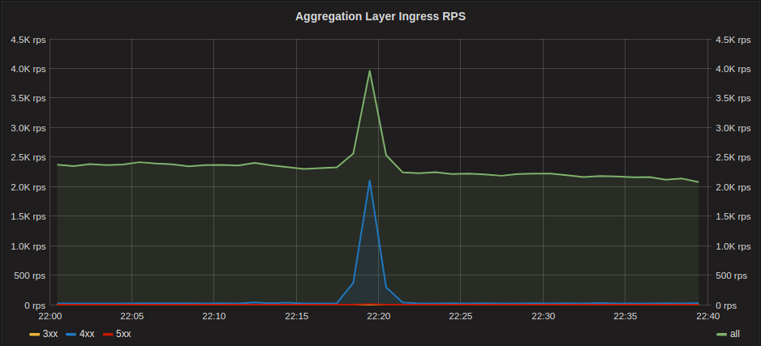
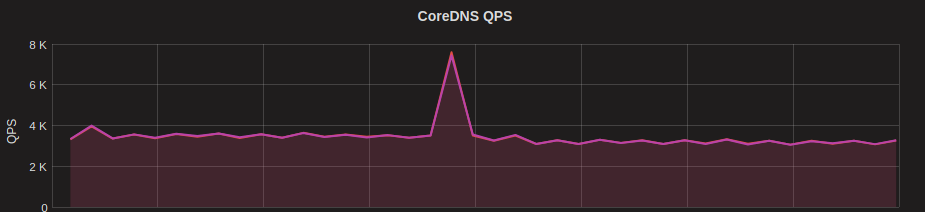
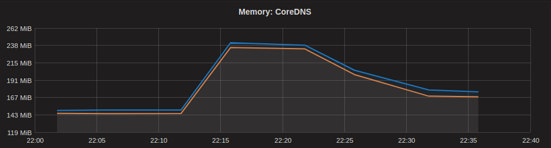

# Total DNS outage in Kubernetes cluster

## Summary

On Monday 7 January 2019, all web product and outfit pages of the [Zalando
Fashion Store][zalando_de] were returning a high amount of errors to customers
for over 1 hour.  The errors were coming from the main data aggregation layer
service running in one of our Kubernetes clusters and was ultimately caused by
an outage of the Kubernetes cluster DNS infrastructure.

## Timeline

The incident started when calls to one of the many downstream services from the
aggregation layer, began to time-out. The aggregation layer returned 404s for
the timed out calls which resulted in clients retrying, creating a spike in
requests to the aggregation layer.

The spike in requests from the aggregation layer then resulted in an equivalent
spike in DNS queries on the Cluster DNS infrastructure (CoreDNS).

The spike in DNS queries further resulted in a spike in memory usage of CoreDNS
pods, which let to the pods running out of memory and getting OOM Killed at the
same time.

The CoreDNS pods did not recover from the initial OOM killing and kept running
out of memory and getting killed. This let to a **total DNS outage** for the
entire cluster.

Because of the DNS outage, the aggregation layer service opened circuit
breakers to downstream services as it was unable to resolve any of the
hostnames and had no DNS caching.

As a side effect of the DNS outage our internal monitoring for the cluster was
also completely down as it needs to talk to external services to trigger alerts
and push metrics.  The missing monitoring meant that it took longer than
expected to notify the on-call Kubernetes engineer, which when called,
identified that CoreDNS pods were getting OOM Killed and manually changed the
Memory requests/limits from `100Mi` to `2000Mi`.

Once the resources were increased, the CoreDNS pods recovered and were able to
handle the load from the cluster.

When the cluster DNS infrastructure was back the aggregation layer closed
circuit breakers and the Zalando Fashion Store completely recovered.

*Note: Graphs depicted are not from the actual incident, but from a later point
in time when CoreDNS was scaled to handle the spikes.*

## Contributing Factors

While we consider the DNS infrastructure to be the biggest factor in this
incident, there were a number of contributing factors which let to the impact:

* There was a sudden spike in requests to the aggregation layer service because
  calls to a single, not so important, downstream service were timing out and
  calls were being retried.
* The aggregation layer service is a Node.js application that uses the default
  [DNS resolution in Node.js][nodejs_dns]. This doesn’t cache any DNS lookups
  and thus results in more DNS lookups than other applications where DNS is
  cached for some time.
* The application was running with the default Kubernetes DNS configuration
  meaning it was affected by the ["ndots 5 problem"][ndots_5_problem]. This
  results in 10 DNS queries for every single DNS lookup of an cluster-external
  name by the application.
* Due to dependencies on services using traffic switching via DNS, the
  application's HTTP client connection pool was configured with a short maximum
  lifetime for all connections. This contributed to a larger number of DNS
  requests due to constantly opening new connections to downstream
  dependencies.
* The CoreDNS pods were configured with a very small memory limit of `100Mi`
  based on historical resource usage data. When the spike occurred it was
  instantly OOM killed and wasn’t able to recover because of the constant high
  load of DNS queries and no way of automatically increasing the memory limit.
  We are running the [Vertical Pod Autoscaler][vpa] for some system components
  (but not CoreDNS) since a few months and it could potentially have helped
  automatically recovering CoreDNS pods in this case.
* Because our monitoring was impacted/lacking in case of DNS outage, the
  incident response was slow and manual. The on-call engineer for the
  aggregation layer service had to call the Kubernetes responsible on-call
  engineer instead of the automatic paging we normally rely on.

## Lessons Learned

From this incident we learned that our Kubernetes DNS infrastructure is far
from resilient enough. It should not be possible for a single application to
"DoS" our DNS infrastructure in a way that impacts everything running in the
cluster. The blast radius of an application increasing the number of DNS
queries should at least be isolated to a single node in the cluster, ideally to
single pods.

While investigating how to improve the DNS infrastructure we got a better
understanding of the many DNS related problems in Kubernetes also described in
this [kubernetes issue][k8s_dns_issue], like [Linux kernel races in the
conntrack handling][conntrack_races] and the ["ndots 5
problem"][ndots_5_problem]. We were already familiar with most of these issues,
[and had mitigations for some of them][flannel_tc], but we didn’t fully
understand how severely it all impacted our DNS infrastructure.

Apart from the issues around the DNS infrastructure itself, we also learned
that our monitoring is not robust enough. While we have some alerting which is
running from outside our clusters, most alerting is run inside the cluster
itself. In this case it meant our On-call engineer wasn’t automatically paged
when the DNS infrastructure crashed and the time to recovery was therefore
longer than it should have been.

## Action Items

* **Introduce a more resilient DNS infrastructure.** We are working on a
  solution where we will run CoreDNS fronted by dnsmasq on every node. This setup
  outperforms any other setup we have considered and tested. We will share a
  longer write-up of this, once we have some more experience with the new setup.
* **Improve high level alerting from outside of clusters.** We should know that
  there is something wrong with the cluster before, or at least at the same
  time as applications in the clusters start to be affected.
* **Improve incident response processes and tooling.** It can happen that automatic
  paging fails for whatever reason. In this case it should be simple for any
  on-call engineers to escalate directly to other teams without going to a
  different tool. One idea we are pursuing is to simplify the escalation process
  via a chat bot.

[zalando_de]: https://zalando.de
[nodejs_dns]: https://nodejs.org/docs/latest/api/dns.html#dns_implementation_considerations
[ndots_5_problem]: https://github.com/kubernetes/dns/issues/159#issuecomment-336449931
[vpa]: https://github.com/kubernetes/autoscaler/tree/master/vertical-pod-autoscaler
[k8s_dns_issue]: https://github.com/kubernetes/kubernetes/issues/56903
[conntrack_races]: https://www.weave.works/blog/racy-conntrack-and-dns-lookup-timeouts
[flannel_tc]: https://github.com/zalando-incubator/kubernetes-on-aws/pull/1228
