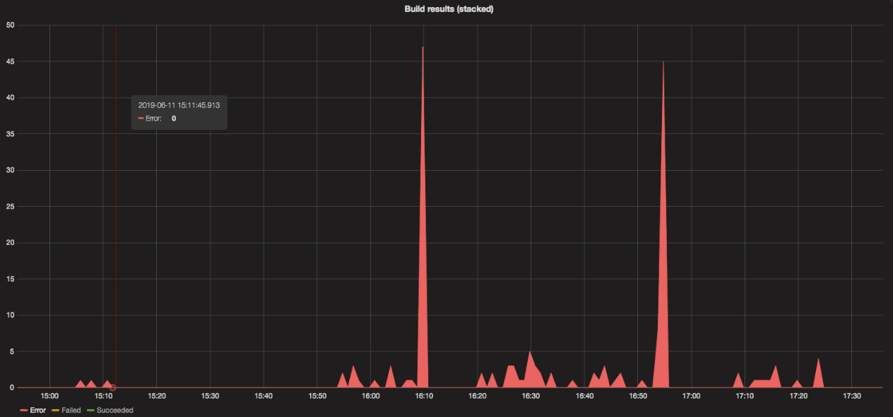

# Build Errors of Continuous Delivery Platform

Zalando operates an inhouse custom-built Continuous Delivery Platform (CDP) for CI/CD. On 11 June 2019, CDP builds were failing for almost an hour.

CDP builds were timing out and failing because Kubernetes builder Pods couldn’t get AWS IAM credentials.
For the Pod to get AWS IAM credentials, [kube2iam](https://github.com/jtblin/kube2iam) has to get the Pod’s IP address. These are set by kubelet process on the assigned node, but Kubelet was delayed in updating Pod statuses for multiple minutes.
The default Kubelet configuration has an extremely low rate limit on the requests to the API server (see [--kube-api-qps documentation](https://kubernetes.io/docs/reference/command-line-tools-reference/kubelet/)).
Due to an unlucky rescaling of the CDP Kubernetes cluster,
only one node was available for the builder Pods, and the rapid creation and deletion of Pods caused Kubelet to fall behind.

To stop the bleeding, the cluster was manually scaled up so builder Pods would be spread over more than 1 node.

For a permanent fix, the [Kubelet QPS was increased from 5 (default) to 50 via a global cluster configuration](https://github.com/zalando-incubator/kubernetes-on-aws/pull/2247).
